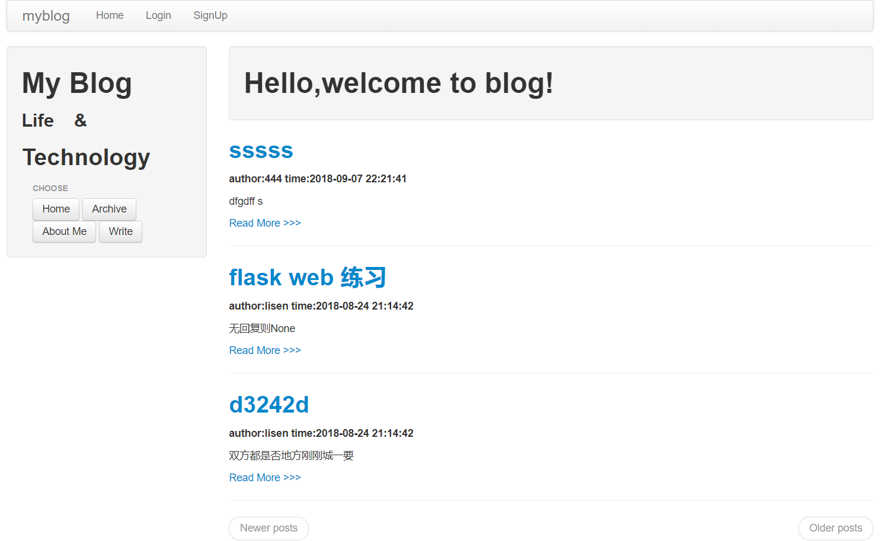
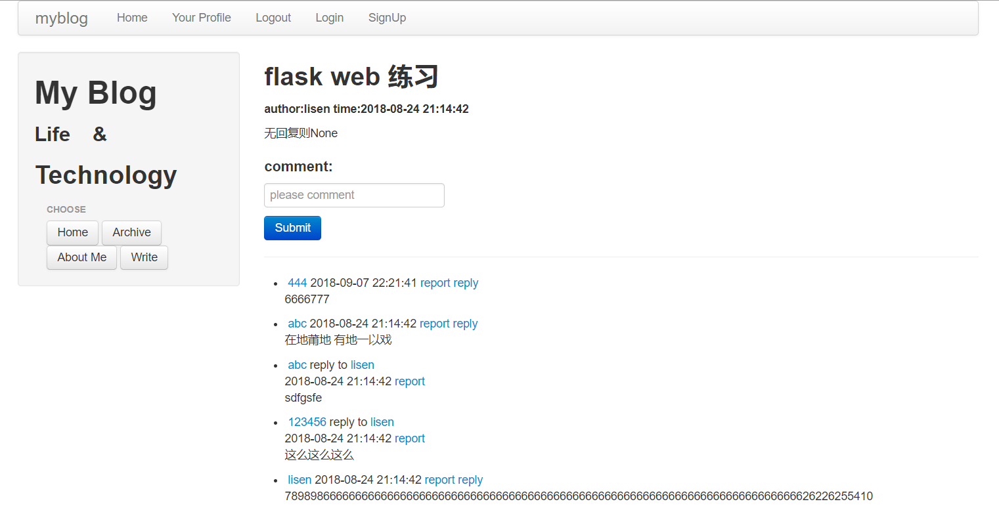
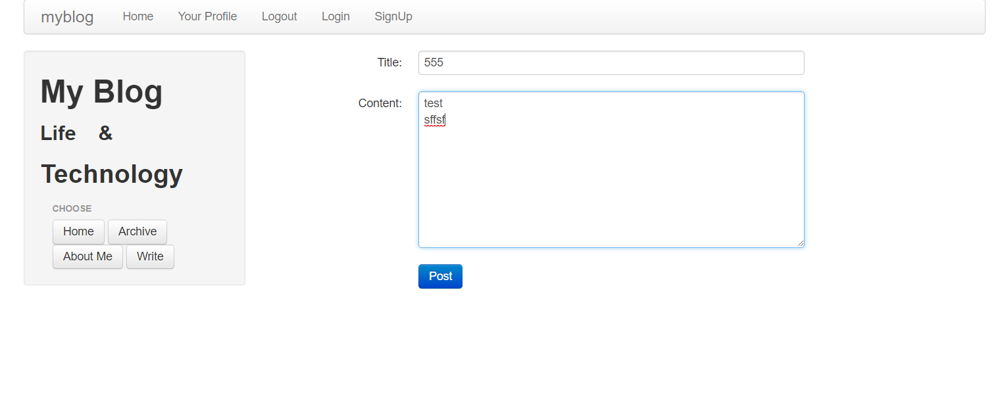
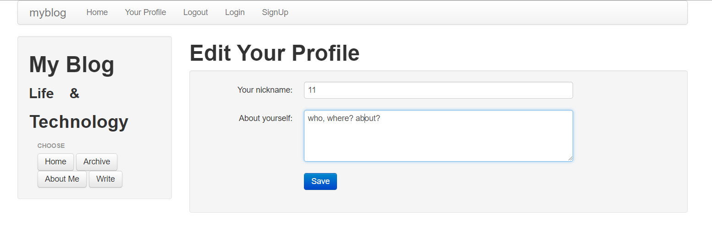
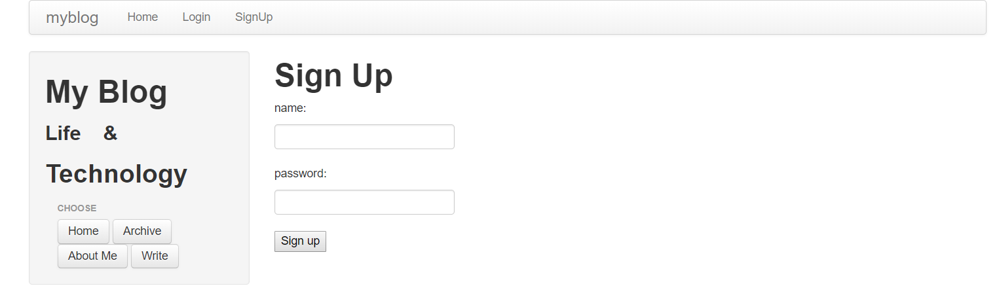

# 基于flask实现的简易博客

#### 快速上手
windows下虚拟环境的建立（dos命令）：
1. 在command命令窗口，cd进入某个文件夹，比如和代码的所在文件夹，然后运行如下命令：virtualenv env
2. cd进入env/scripts文件夹，运行命令进入虚拟环境：activate  激活   
3. 在虚拟环境中安装依赖包，cd进入代码requirement.txt所在的文件夹，运行命令：pip install -r requirement.txt
4. 在虚拟环境中生成数据库：python db_create.py
5. 在虚拟环境中运行程序：python run.py
6. 在浏览器中测试网页：http://127.0.0.1:5000/

***
#### 一、技术栈： 
boostrap + flask + sqlalchemy + sqlite3（数据库）

#### 二、python版本： 
Python3.x

#### 三、新增功能
1. 不需要登陆，在首页，即可查看所有用户写的博客列表(标题，时间，用户，部分内容)，点进去可看到详细内容。
2. 对每条博客，添加留言评论功能，用户登陆后既可以表评论。

#### 四、依赖包
> click==6.7   
Flask==0.12.2   
Flask_Login==0.4.0   
Flask_SQLAlchemy==2.2   
Flask_WTF==0.14.2   
itsdangerous==0.24   
Jinja2==2.9.6    
MarkupSafe==1.0   
SQLAlchemy==1.1.14   
Werkzeug==0.12.2   
WTForms==2.1   
   
#### 五、文件目录
myapp    
├── forms.py      
├── init.py    
├── models.py    
├── static    
│ ├── css     
│ │ ├── bootstrap.min.css    
│ │ └── bootstrap-responsive.min.css    
│ └── js    
│ └── bootstrap.min.js    
├── templates    
│ ├── base.html    
│ ├── change.html    
│ ├── detail.html    
│ ├── edit.html    
│ ├── flash.html    
│ ├── index.html    
│ ├── login.html    
│ ├── manage.html     
│ ├── sign_up.html     
│ ├── user.html    
│ └── write.html    
└── views.py   
 
## 六、功能演示  
   
   
   
   
   
  
